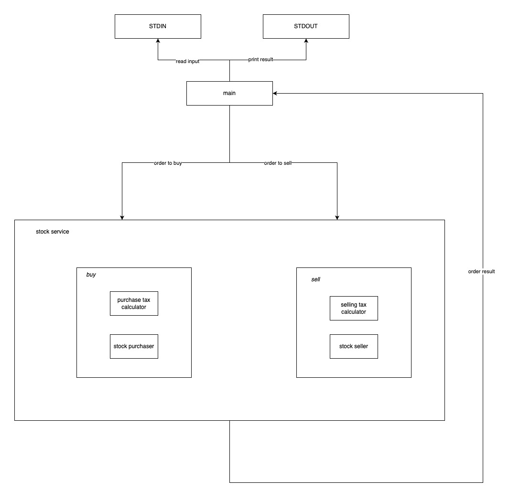

# Ganho de Capital

The goal of this exercise is to implement a command-line interface (CLI) program that calculates the tax to be paid on profits or losses from stock market operations.

## Architecture 

### Technical decision

I've chosen to use the Go programming language because it is the one I am most comfortable with at the moment.

The [main](main.go) function serves as the application's entry point, responsible for reading, parsing, and validating the simulation input, which consists in a list of [Operation](input/operation.go), and printing the [Simulation](output/simulation.go) result in the stdout. 

Each simulation creates a fresh [Stock](entity/stock.go) entity, which maintains the state for each operation. For instance, the buy and sell operations may change stock availability (quantity), average price and balance. 

The business logic is located in the service package. The main interacts with the [StockService](services/stock.go) in order to perform the buy and sell operations of a given stock. This service is responsible for calculating the tax and returning the updated stock for its clients. 

By having separate implementations for the tax calculation, such as [PurchaseTaxCalculator](services/taxpurchase.go) and [SellingTaxCalculator](services/taxseller.go), we can make modifications without affecting other parts of the application, such as the  [StockPurchaser](services/stockpurchaser.go) service, which is responsible for performing the purchase of a given stock and the [StockSeller](services/stockseller.go) which is responsible for selling a given stock.

The tax percentage and the tax-free amount threshold are configurable in the [config](config/config.go) file.

### High-level architecture diagram



### Limitations

Go's standard library marshals floating points to the shortest representation necessary, therefore it will omit the decimal part if it's .00. For example, the following input:
```
[{"operation":"buy", "unit-cost":10.00, "quantity": 100}]
```

outputs: 
```
[{"tax":0}]
```

and according to the specification it should be:
```
[{"tax":0.00}]
```

It would require a custom encoding/decoding of JSON implementation to output the expected format, which I considered to be out of scope.

### Next steps

- Improve integrated tests to cover CLI input and assert output
- Evolve architecture to meet new requirements
- Add logs
- Improve error handling, to output errors according to a future specification instead of panicking 
- Add execution metrics
- Limit/validate the input size

### 

## How to run

### Application

Build docker container
```sh
docker build -t ganho-capital:1.0.0 .
```

Run application container
```sh
docker run --name ganho-capital --rm -i ganho-capital:1.0.0 < input.txt
```

Note: You can replace the input.txt for any valid input or file

### Tests

The integration tests can be found in [main_test.go](main_test.go), while the unit tests are located in the other _test.go files, such as [stock_test.go](entity/stock_test.go).

All tests can be run with the following commands: 

Build docker container
```sh
docker build -t ganho-capital-tests:1.0.0 -f Dockerfile.test .
```
Run tests 
```sh
docker run -i ganho-capital-tests:1.0.0
```